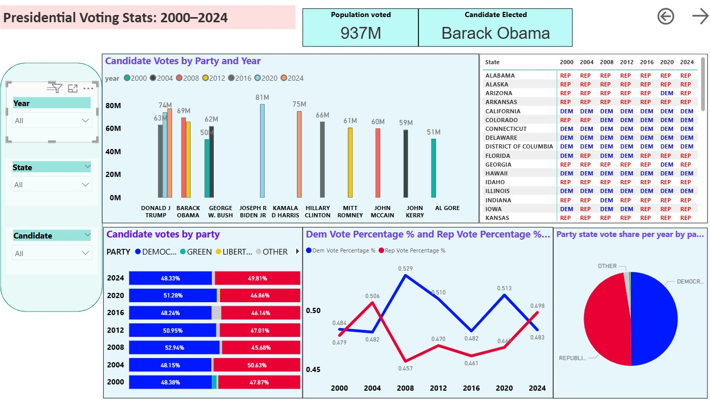

# PowerBI_project_US_elections

Data journalism Project about the U.S. Presidential elections that have happened so far in the 21st century.

Tasked as a data journalist for a political magazine, and you have been asked to create a graphic feature for the online version of the magazine. Your editor wants you to look back at the Presidential elections so far in the 21st century and tell a story about them.

